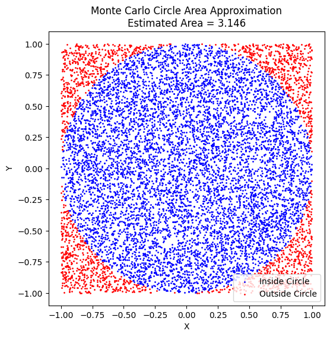

# 前半目次
## Chapter11 サンプリング法 序章
- サンプリング法の基本アイデア
## 11.1 基本的なサンプリングアルゴリズム(モンテカルロ法)
- 11.1.1 標準的な分布
- 11.1.2 棄却サンプリング
- 11.1.3 適応的棄却サンプリング
- 11.1.4 重点サンプリング
- 11.1.5 SIR
- 11.1.6 サンプリングとEMアルゴリズム
---

# 後半目次

## 11.2 マルコフ連鎖モンテカルロ(MCMC)
- 11.2.1 マルコフ連鎖とメトロポリス法
- 11.2.2 メトロポリス・ヘイスティング法

## 11.3 ギブスサンプリング

## 11.4 スライスサンプリング

## 11.5 ハイブリッドモンテカルロ(統計力学との融合)
- 11.5.1 力学系
- 11.5.2 ハイブリッドモンテカルロ

## 11.6 分配関数の推定
---

# Chapter 11 サンプリング法 序章
- **第10章**: 決定論的近似に基づく推論アルゴリズム
  - 変分ベイズ法
  - 期待伝播法
- これらの方法は解析的手法を用いて近似推論を行う
- ほとんどの実用的な確率モデルにおいて、正確な推論は困難
- **第11章**: 数値サンプリングに基づく近似推論法
  - モンテカルロ法
  - サンプリングアルゴリズムの詳細
- 近似法としてモンテカルロ法を使用

---

## あらためて、近似推論の目的

- 近似推論を用いることで事後分布を知ることができるが、多くの場合は事後分布そのものを使うのではなく事後分布を元に計算した期待値を使うことが多い
- 関数 $f(z)$ について、 $p(z)$ のもとでの期待値 $E[f]$ を求める
- 連続変数の場合: $E[f] = \int f(z)p(z) \, dz ・・・(11.1)$ 
- 離散変数の場合：$E[f] = \sum f(z)p(z)$

---

## サンプリング法の基本アイデア
- 分布 $p(z)$ から独立にサンプル $z^{(l)}$ を取得 ($l = 1,...,L$)
- 式11.1の期待値 $E[f]$ を有限の総和で近似
- 推定量 $f \approx \frac{1}{L} \sum_{l=1}^{L} f(z^{(l)})$
- 図11.1は関数と分布の関係を示したただの模式図である。後ほど出てくるがこの図は全く良い近似ではない点に注意

<!-- ---

## 具体例
- 例として、円の内側の面積を求める問題を考える
- $f(z)$：評価関数、円の内側か外側かを判定する関数
- $p(z)$：目標分布、円の内側にある点の分布
- ランダムにサンプリングするモンテカルロ法だと右の結果になる
 -->

---

## 理想的な推定量の性質

- サンプル $z^{(l)}$ が分布 $p(z)$ に従って抽出されている限りは、$E[\hat{f}] = E[f]$ が成り立ち、$\hat{f}$は正しい平均を持つ
- これに基づいて分布 $p(z)$ のもとでの $z^{(l)}$ の分散は $\text{var}[\hat{f}] = \frac{1}{L} E[(f - E[f])^2]$ となる
- よって$z^{(l)}$ が分布 $p(z)$ に従って抽出されている限り、推定量の精度(分散)は $z$ の次元に依存しないため、少数のサンプルでも高精度な期待値の推定が可能となる
  - 実際、十分な精度で期待値を計算するには10~20のサンプリングで十分
  (と書いてあるが根拠は？)

---

## 実用におけるサンプリングの課題

- 実際はサンプル$z^{(l)}$が独立でない場合が多く、サンプルが重複するため実効的なサンプルサイズは見かけよりも小さくなる
- また、図11.1の例だと$z^{(l)}$ が分布 $p(z)$ に従って抽出されていない
  - $p(z)$が小さい(確率の低い)領域で$f(z)$の期待値が大きいため、小さな確率の領域から期待値に大きく影響している
  - この場合、サンプリング数を多くして精度を上げる必要がある

---

## 同時分布のサンプリング
- $p(z)$は同時分布であることが多く、グラフィカルモデルで指定するのが便利
- 観測変数のない有向グラフの場合、伝承サンプリング(8.1.2で紹介)で簡単に行える
- 同時分布 $p(z) = \prod_{i=1}^{M} p(z_i | pa_i)$
  - $z_i$は、グラフィカルモデルのノードに属する変数集合
  - $pa_i$は、ノードiの親となる変数集合
- 各ノードの条件付き分布から順番にサンプルを抽出していくが、各ステップで親となるすべての変数の値が決まっているため、サンプリングは常に可能である
  - 最終的に同時分布から1つのサンプルが得られる

---

## 観測値を持つ有向グラフの場合
- いくつかのノードに対して観測値が与えられる場合、離散変数の場合にはさきほどのアプローチを拡張したロジックサンプリングアプローチが可能である
  - これは重点サンプリング(後ほど述べる)の特別な場合である
- ロジックサンプリングのアルゴリズム
  - 各ステップで観測値を持つ変数$z_i$のサンプル値と観測値が一致する場合にサンプルを保持される
  - 一致しない場合は、サンプル全体を破棄して最初のノードから再開する
  - つまり、隠れ変数とデータ変数の同時分布からサンプリングし観測データと一致しないサンプルを破棄することと同じであるため、事後分布から正しくサンプリングを行う
    - 矛盾すると即打ち切りのため、厳密にはわずかに時間を節約している
- しかし、観測変数の数が増えると受け入れ確率が急速に減少するため、通常用いない

---

## 無向グラフとサンプリング

- 事前分布でさえ、ワンパスでサンプリングする手段はない
- ギブスサンプリング(11.3節)などの計算コストの高い手法が必要

---

## 周辺分布からのサンプリング
- 同時分布だけでなく、周辺分布からサンプリングが必要な場合
- 同時分布 $p(u, v)$ からサンプルを取得できる場合は周辺分布の計算は簡単で、各サンプルで $v$ の値を無視することで周辺分布 $p(u)$ からのサンプリングとなる

---

# 11.1 基本的なサンプリングアルゴリズム

このセクションでは、与えられた分布からランダムサンプルを生成するためのいくつかの簡単な戦略を考える
コンピュータによるランダムサンプリングは実際には疑似乱数となるが、ここでは一様な乱数生成機として扱う

---

## 11.1.1 標準的な分布

まず、均一に分布した乱数のソースが既に利用可能であると仮定して、単純な非均一分布から乱数を生成する方法を考える
$z$ が区間 $(0, 1)$ に均一に分布していると仮定し、$y = f(z)$ という関数を使用して $z$ の値を変換する
ここでの目標は、$y$ の値が特定の分布 $p(y)$ に従うように関数 $f(z)$ を選択することである
$y$ の分布は次の式に従う

$$
p(y) = p(z) \left| \frac{dz}{dy} \right|
・・・(11.5)
$$

ここで、$p(z) = 1$ である

---

式 (11.5) を不定積分すると次のようになる

$$
z = h(y) \equiv \int_{-\infty}^{y} p(\tilde{y}) d\tilde{y}
・・・(11.6)
$$

式11.6より$y = h^{-1}(z)$ となる
つまり、目標分布の不定積分の逆関数を使用して、一様分布の乱数変換をする必要があり、これを図示したのが図11.2

---

## 例: 指数分布

具体例として指数分布を考える

$$
p(y) = \lambda \exp(-\lambda y)
$$

ここで、$0 \leq y < \infty$ である
この場合、式11.6における積分の下界は 0 であり、次のようになる

$$
h(y) = 1 - \exp(-\lambda y)
$$

したがって、均一に分布した変数 $z$ を次のように変換すると、$y$ は指数分布に従う

$$
y = -\lambda^{-1} \ln(1 - z)
$$

---

## 例: コーシー分布

もう一つの例として、コーシー分布を考える

$$
p(y) = \frac{1}{\pi} \frac{1}{1 + y^2}
$$

この場合、不定積分の逆関数は $\tan$ 関数で表現できる

---

## 多変量への一般化

多変量への一般化は簡単で、ヤコビアンをかませればよい

$$
p(y_1, \ldots, y_M) = p(z_1, \ldots, z_M) \left| \frac{\partial(z_1, \ldots, z_M)}{\partial(y_1, \ldots, y_M)} \right|
$$

---

## 例: ボックス＝ミュラー法

ガウス分布からサンプルを生成するためのボックス＝ミュラー法を考える
まず、区間 $(-1, 1)$ に均一に分布した乱数のペア $z_1, z_2$ を生成する
次に、次の条件を満たすペアを破棄する

$$
z_1^2 + z_2^2 \leq 1
$$

これにより、単位円内の点の均一分布が得られる
次に、各ペア $z_1, z_2$ に対して次の量を評価する

$$
y_1 = z_1 \sqrt{-2 \ln z_1 r^2}
$$

$$
y_2 = z_2 \sqrt{-2 \ln z_2 r^2}
$$

ここで、$r^2 = z_1^2 + z_2^2$ である
これにより、$y_1$ と $y_2$ は独立であり、それぞれが平均 0、分散 1 のガウス分布に従う

---

ボックス=ミュラー法を図示すると、図11.3のように単位円内で一様分布するサンプルの生成となる

---

## 11.1.1 まとめ

ここで紹介した変数変換を用いた手法は、求めたい分布の不定積分と
これが可能な場合は限られているため、より一般的な戦略を探す必要がある
ここでは、棄却サンプリングと重点サンプリングという2つの技法を紹介する

---

# 11.1.2 棄却サンプリング

- 棄却サンプリングは、特定の制約の下で比較的複雑な分布からサンプルを取得するための手法である
- ここでは、単変量分布を考え、その後に多次元への拡張について説明する

---

## 基本的なアイデア

- 分布 $p(z)$ からサンプルを取得したいが、直接サンプリングするのが難しい場合を考える
- $p(z)$ を正規化定数 $Z_p$ を除いて評価できると仮定
  $$
  p(z) = \frac{1}{Z_p} \tilde{p}(z)
  $$
  ここで、$\tilde{p}(z)$ は容易に評価できるが、$Z_p$ は未知

---

## 提案分布 $q(z)$

- 棄却サンプリングを適用するためには、簡単にサンプルを生成できる提案分布 $q(z)$ が必要です。

---

## 棄却サンプリングの手順

1. 提案分布 $q(z)$ からサンプル $z_0$ を生成。
2. 一様分布 $[0, kq(z_0)]$ からサンプル $u_0$ を生成。
3. $u_0 > \tilde{p}(z_0)$ ならサンプルを棄却し、そうでなければ受け入れる。

---

## 比較関数

- 定数 $k$ を導入し、すべての $z$ に対して $kq(z) \geq \tilde{p}(z)$ となるようにします。
- 比較関数 $kq(z)$ は次の図のように示されます。

---

## 図: 棄却サンプリングの方法

---

## 受け入れ確率

- サンプルが受け入れられる確率は次のように与えられます。
  $$
  p(\text{accept}) = \int \frac{\tilde{p}(z)}{kq(z)} q(z) dz = \frac{1}{k} \int \tilde{p}(z) dz
  $$
- 棄却されるポイントの割合は、未正規化分布 $\tilde{p}(z)$ の面積と比較関数 $kq(z)$ の面積の比に依存します。

---
## 提案分布 $q(z)$

棄却サンプリングを適用するためには、簡単にサンプルを生成できる提案分布 $q(z)$ が必要である

---

## 棄却サンプリングの手順

1. 提案分布 $q(z)$ からサンプル $z_0$ を生成
2. 一様分布 $[0, kq(z_0)]$ からサンプル $u_0$ を生成
3. $u_0 > \tilde{p}(z_0)$ ならサンプルを棄却し、そうでなければ受け入れる

---

## 比較関数

定数 $k$ を導入し、すべての $z$ に対して $kq(z) \geq \tilde{p}(z)$ となるようにする
比較関数 $kq(z)$ は次の図のように示される

---

## 図: 棄却サンプリングの方法

---

## 受け入れ確率

サンプルが受け入れられる確率は次のように与えられる
$$
p(\text{accept}) = \int \frac{\tilde{p}(z)}{kq(z)} q(z) dz = \frac{1}{k} \int \tilde{p}(z) dz
$$
棄却されるポイントの割合は、未正規化分布 $\tilde{p}(z)$ の面積と比較関数 $kq(z)$ の面積の比に依存する

---
# 11.1.3 適応的棄却サンプリング

多くの場合、棄却サンプリングを適用しようとすると、適切な解析的形のエンベロープ分布 $q(z)$ を決定するのが難しい
代替アプローチとして、分布 $p(z)$ の測定値に基づいてエンベロープ関数を動的に構築する方法がある（Gilks and Wild, 1992）
エンベロープ関数の構築は、$p(z)$ が対数凹関数である場合、つまり $\ln p(z)$ の導関数が $z$ の非増加関数である場合に特に簡単である
適切なエンベロープ関数の構築は、図11.6に示されている

---

## エンベロープ関数の構築

$\ln p(z)$ とその勾配を初期のグリッドポイントのセットで評価し、得られた接線の交点を使用してエンベロープ関数を構築する
次に、エンベロープ分布からサンプル値を生成する
これは、エンベロープ分布の対数が一連の線形関数で構成されているため簡単である

---

## 図: 対数凹関数のエンベロープ関数の構築

---

## エンベロープ分布

エンベロープ分布は次の形の区分的指数分布で構成される

$$
q(z) = k_i \lambda_i \exp \{ -\lambda_i (z - z_{i-1}) \} \quad z_{i-1} < z \leq z_i
$$

サンプルが生成されたら、通常の棄却基準を適用する
サンプルが受け入れられた場合、それは目的の分布からのサンプルとなる
サンプルが棄却された場合、それはグリッドポイントのセットに組み込まれ、新しい接線が計算され、エンベロープ関数が洗練される

---

## 受け入れ率の向上

グリッドポイントの数が増えると、エンベロープ関数は目的の分布 $p(z)$ に近づき、棄却の確率が減少する
導関数の評価を避けるバリアントも存在する（Gilks, 1992）
適応的棄却サンプリングのフレームワークは、棄却サンプリングの各ステップの後にメトロポリス・ヘイスティングスステップを追加することで、対数凹関数でない分布にも拡張できる（Gilks et al., 1995）

---

## 高次元空間での棄却サンプリング

棄却サンプリングが実用的であるためには、比較関数が必要な分布に近いことが重要である
高次元空間で棄却サンプリングを使用すると、受け入れ率が次第に低下する
例えば、ゼロ平均の多変量ガウス分布からサンプルを取得する問題を考える
提案分布もゼロ平均のガウス分布であり、共分散が $\sigma_q^2 I$ であるとする
この場合、最適な $k$ の値は $k = (\sigma_q / \sigma_p)^D$ であり、受け入れ率は次のように与えられる

$$
\text{acceptance rate} = \frac{1}{k}
$$

---

## 図: 高次元空間での棄却サンプリング

---

## まとめ

棄却サンプリングは1次元または2次元では有用であるが、高次元の問題には適していない
しかし、高次元空間でのサンプリングのためのより洗練されたアルゴリズムのサブルーチンとして役立つことがある

---

# 11.1.4 重点サンプリング

複雑な確率分布からサンプルを取得したい主な理由の一つは、(11.1) の形式の期待値を評価できるようにするためである
重点サンプリングの技法は、期待値を直接近似するためのフレームワークを提供するが、分布 $p(z)$ からサンプルを取得するメカニズム自体は提供しない

---

## 基本的なアイデア

有限和近似は、分布 $p(z)$ からサンプルを取得できることに依存する
しかし、$p(z)$ から直接サンプルを取得するのが実際には難しい場合、$p(z)$ を任意の $z$ の値に対して容易に評価できると仮定する
単純な戦略として、$z$ 空間を一様なグリッドに離散化し、次の形式の和として積分を評価する方法がある

$$
E[f] \approx \sum_{l=1}^{L} p(z^{(l)}) f(z^{(l)})
$$

---

## 提案分布 $q(z)$

棄却サンプリングと同様に、重点サンプリングは提案分布 $q(z)$ を使用する
提案分布 $q(z)$ からサンプルを取得し、次の形式の有限和として期待値を表現する

$$
E[f] = \int f(z) p(z) dz = \int f(z) \frac{p(z)}{q(z)} q(z) dz \approx \frac{1}{L} \sum_{l=1}^{L} \frac{p(z^{(l)})}{q(z^{(l)})} f(z^{(l)})
$$

---

## 重要度重み

重要度重み $r_l = \frac{p(z^{(l)})}{q(z^{(l)})}$ は、誤った分布からサンプリングすることによって生じるバイアスを補正する
棄却サンプリングとは異なり、生成されたすべてのサンプルが保持される

---

## 正規化定数の評価

分布 $p(z)$ は正規化定数 $Z_p$ を除いて評価できる場合が多い
同様に、重点サンプリング分布 $q(z)$ も正規化定数 $Z_q$ を持つと仮定する

$$
E[f] = \frac{Z_q}{Z_p} \frac{1}{L} \sum_{l=1}^{L} \tilde{r}_l f(z^{(l)})
$$

ここで、$\tilde{r}_l = \frac{\tilde{p}(z^{(l)})}{\tilde{q}(z^{(l)})}$ である

---

## 正規化定数の比の評価

同じサンプルセットを使用して、正規化定数の比 $Z_p / Z_q$ を評価できる

$$
\frac{Z_p}{Z_q} = \frac{1}{L} \sum_{l=1}^{L} \tilde{r}_l
$$

したがって、

$$
E[f] \approx \sum_{l=1}^{L} w_l f(z^{(l)})
$$

ここで、

$$
w_l = \frac{\tilde{r}_l}{\sum_{m} \tilde{r}_m} = \frac{\tilde{p}(z^{(l)}) / q(z^{(l)})}{\sum_{m} \tilde{p}(z^{(m)}) / q(z^{(m)})}
$$

---

## 重点サンプリングの成功

重点サンプリングの成功は、提案分布 $q(z)$ が目的の分布 $p(z)$ にどれだけ一致するかに大きく依存する
$p(z) f(z)$ が強く変動し、その質量の大部分が $z$ 空間の比較的小さな領域に集中している場合、重要度重み $\{r_l\}$ は大きな値を持ついくつかの重みによって支配される可能性がある
この場合、実効サンプルサイズは見かけのサンプルサイズ $L$ よりもはるかに小さくなる可能性がある

---

## 図: 重点サンプリングの方法

---

## まとめ

重点サンプリングは、直接サンプルを取得するのが難しい分布から期待値を評価するための強力な手法である
しかし、提案分布 $q(z)$ が目的の分布 $p(z)$ に適切に一致しない場合、結果が大きく誤る可能性がある

---

# 11.1.5 サンプリング-重点-リサンプリング

棄却サンプリング法は、定数 $k$ の適切な値を決定することに依存する
多くの分布対 $p(z)$ と $q(z)$ に対して、$k$ の適切な値を決定することは実際には困難である
$k$ が十分に大きい値であると、受け入れ率が非常に低くなる

---

## SIRの基本的なアイデア

SIRアプローチも提案分布 $q(z)$ を使用するが、定数 $k$ を決定する必要がない
この手法は2つのステージからなる
1. 提案分布 $q(z)$ から $L$ 個のサンプル $z^{(1)}, \ldots, z^{(L)}$ を生成する
2. 重み $w_1, \ldots, w_L$ を (11.23) 式を使用して構築する
3. 重み $w_1, \ldots, w_L$ に基づいて、離散分布 $(z^{(1)}, \ldots, z^{(L)})$ から $L$ 個のサンプルを再サンプリングする

---

## 重みの計算

重み $w_l$ は次のように計算される

$$
w_l = \frac{\tilde{p}(z^{(l)})}{\tilde{q}(z^{(l)})}
$$

---

## 再サンプリングの結果

再サンプリングされた $L$ 個のサンプルは、$p(z)$ に従って分布するが、これは $L \to \infty$ の極限で正確になる
一変量の場合、再サンプリングされた値の累積分布は次のように与えられる

$$
p(z \leq a) = \frac{\sum_{l: z^{(l)} \leq a} \tilde{p}(z^{(l)}) / \tilde{q}(z^{(l)})}{\sum_{l} \tilde{p}(z^{(l)}) / \tilde{q}(z^{(l)})}
$$

---

## 極限での挙動

$L \to \infty$ の極限を取ると、和は元のサンプリング分布 $q(z)$ に従って重み付けされた積分に置き換えられる

$$
p(z \leq a) = \frac{\int I(z \leq a) \tilde{p}(z) / \tilde{q}(z) q(z) dz}{\int \tilde{p}(z) / \tilde{q}(z) q(z) dz} = \int I(z \leq a) p(z) dz
$$

これは $p(z)$ の累積分布関数である

---

## 有限サンプルの場合

有限の $L$ の場合、再サンプリングされた値は目的の分布からのみ近似的に取得される
棄却サンプリングと同様に、提案分布 $q(z)$ が目的の分布 $p(z)$ に近づくほど近似は改善される

---

## 期待値の評価

分布 $p(z)$ に関するモーメントが必要な場合、元のサンプルと重みを使用して直接評価できる

$$
E[f(z)] = \int f(z) p(z) dz = \int f(z) \frac{\tilde{p}(z)}{q(z)} q(z) dz \approx \sum_{l=1}^{L} w_l f(z^{(l)})
$$

---

## まとめ

SIRは、定数 $k$ を決定する必要がないため、棄却サンプリングに対する有用な代替手法である
提案分布 $q(z)$ が目的の分布 $p(z)$ に近づくほど、再サンプリングされたサンプルは目的の分布に従う

---

# 11.1.6 サンプリングとEMアルゴリズム

モンテカルロ法は、ベイズフレームワークの直接実装のメカニズムを提供するだけでなく、頻度主義のパラダイムでも役割を果たす
例えば、最大尤度解を見つけるために使用される
特に、サンプリング法は、Eステップを解析的に実行できないモデルのEMアルゴリズムのEステップを近似するために使用できる

---

## Q関数の近似

隠れ変数 $Z$、観測変数 $X$、パラメータ $\theta$ を持つモデルを考える
Mステップで $\theta$ に関して最適化される関数は、次のように与えられる完全データ対数尤度の期待値である

$$
Q(\theta, \theta_{\text{old}}) = \int p(Z|X, \theta_{\text{old}}) \ln p(Z, X|\theta) dZ
$$

サンプリング法を使用して、この積分を現在の事後分布 $p(Z|X, \theta_{\text{old}})$ から抽出されたサンプル $\{Z^{(l)}\}$ による有限和で近似する

$$
Q(\theta, \theta_{\text{old}}) \approx \frac{1}{L} \sum_{l=1}^{L} \ln p(Z^{(l)}, X|\theta)
$$

---

## モンテカルロEMアルゴリズム

Q関数は通常の方法でMステップで最適化される
この手順はモンテカルロEMアルゴリズムと呼ばれる

---

## MAP推定への拡張

事前分布 $p(\theta)$ が定義されている場合、Q関数に $\ln p(\theta)$ を追加してからMステップを実行することで、$\theta$ の事後分布のモード（MAP推定）を見つける問題に拡張できる

---

## ストキャスティックEM

モンテカルロEMアルゴリズムの特定のインスタンスであるストキャスティックEMは、有限混合モデルを考え、各Eステップで1つのサンプルを抽出する場合に発生する
ここで、潜在変数 $Z$ は、各データポイントを生成する混合成分のどれかを特徴付ける
Eステップでは、データセット $X$ に対して事後分布 $p(Z|X, \theta_{\text{old}})$ から $Z$ のサンプルを抽出する
これにより、各データポイントを混合成分の1つにハードに割り当てる
Mステップでは、このサンプル化された事後分布の近似を使用して、通常の方法でモデルパラメータを更新する

---

## データ補完アルゴリズム

最大尤度アプローチから完全なベイズ処理に移行し、パラメータベクトル $\theta$ の事後分布からサンプルを取得する場合を考える
原則として、結合事後分布 $p(\theta, Z|X)$ からサンプルを取得したいが、これは計算的に困難であると仮定する
完全データパラメータ事後分布 $p(\theta|Z, X)$ からサンプルを取得するのが比較的簡単であると仮定する
これにより、データ補完アルゴリズムがインスパイアされ、Iステップ（Eステップに類似）とPステップ（Mステップに類似）の2つのステップを交互に実行する

---

## IPアルゴリズム

### Iステップ

$p(Z|X)$ からサンプルを取得したいが、直接行うことはできない
したがって、次の関係を利用する

$$
p(Z|X) = \int p(Z|\theta, X)p(\theta|X) d\theta
$$

まず、現在の事後分布 $p(\theta|X)$ からサンプル $\theta^{(l)}$ を抽出し、次にこれを使用して $p(Z|\theta^{(l)}, X)$ からサンプル $Z^{(l)}$ を抽出する

---

### Pステップ

次の関係を利用する

$$
p(\theta|X) = \int p(\theta|Z, X)p(Z|X) dZ
$$

Iステップから得られたサンプル $\{Z^{(l)}\}$ を使用して、次のように $\theta$ の事後分布の改訂推定を計算する

$$
p(\theta|X) \approx \frac{1}{L} \sum_{l=1}^{L} p(\theta|Z^{(l)}, X)
$$

---

## まとめ

サンプリングとEMアルゴリズムは、ベイズフレームワークと頻度主義の両方で重要な役割を果たす
モンテカルロ法は、解析的に実行できないEステップを近似するために使用される
データ補完アルゴリズムは、完全なベイズ処理において事後分布からサンプルを取得するための強力な手法である
